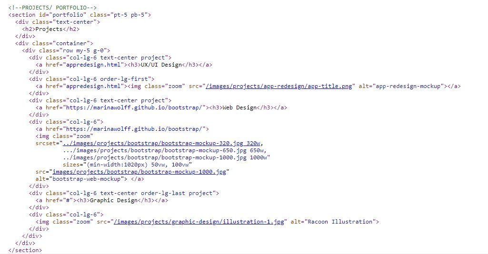
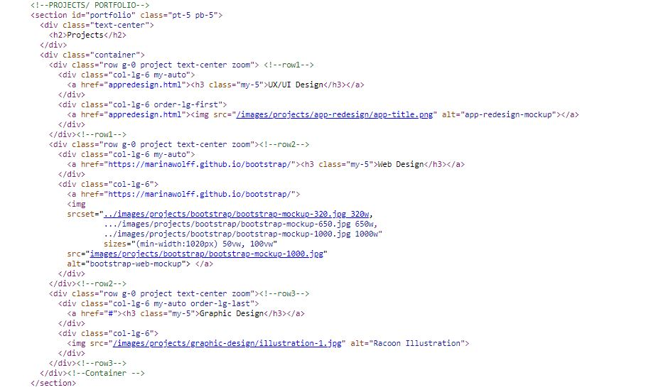

# Web Portfolio 

## Notes

I started this web portfolio by creating a mockup in Adobe XD for 3 different devices sizes: 390px, 768px, and 1920px. Also, I did research using the UX Design process to identify the users and discover the best way to create the website considering the user's needs.
After that, I used HTML, Bootstrap framework, and CSS to build the web portfolio. Most of the responsive design was created by using bootstrap classes and CSS was used to give a unique style to my website.
 
1. The most challenging part I faced creating this web portfolio was the Projects Section. When I created this section on Adobe XD I didn't realize this would be a challenge for me. However, when I started to add the HTML tags and Bootstrap classes, I was not getting the result I was expecting. First, I had to find a class to remove the default grid padding. I used the class g-0 and was able to get a great result. Secondly, In order to create this section, I used a div container and only one div row child for all the items inside the grid. Because the order of the images changes between the breakpoints I was using the class order-lg-number to modify the order of the divs inside the grid, but I was not having the order desired. The happy moment came to me when I made a sketch on a piece of paper of the layout I was looking for and visualized all the divs I should create. After doing that I found the solution for my problem: I needed 1 div row child for both items in a row. 

The image below shows how I was coding the Projects Section and not getting the results I expected. 

The image below shows how I fixed the problem. 

2. Another challenge was to discover how to create a proper README file. This was not part of the portfolio website, but of the entire project and I was determined to learn how to create it using the Markdown language. Markdown is a very simple language to learn and after doing some online research I was able to create a basic file.   

### Improvements: 
There are some improvements I would like to make to my portfolio in the future: 
- First, I would like to create a navigation bar that changes the color when scrolling, so I can have a 100% transparent navbar on the first page and a solid colored navbar once the user reaches the About section and beyond. 
- Secondly, once I develop more projects, I would like to create one page for each category (UI/UX Design, Web Design, and Graphic Design), and gather all my projects related to that category on their specific page. 
- Thirdly, I would like to add a form section where the users can send me messages directly from the webpage. 

## References

### Frameworks
- Bootstrap 5:
    https://getbootstrap.com/

### Fonts
- Google Fonts
    * Roboto Font: 
        https://fonts.google.com/specimen/Roboto?query=roboto
    * Sintony Font: 
        https://fonts.google.com/specimen/Sintony?query=sintony

### Icons
- Bootstrap Icons
    * https://icons.getbootstrap.com/

        - [Envelope Fill](https://icons.getbootstrap.com/icons/envelope-fill/)
        - [LinkedIn](https://icons.getbootstrap.com/icons/linkedin/)
        - [Instagram](https://icons.getbootstrap.com/icons/instagram/)
        - [WhatsApp](https://icons.getbootstrap.com/icons/whatsapp/)
        - [GitHub](https://icons.getbootstrap.com/icons/github/)
        - [Chevron Double Up](https://icons.getbootstrap.com/icons/chevron-double-up/)
        - [Filter Right](https://icons.getbootstrap.com/icons/filter-right/)

- Iconfinder
    * [UI/UX Design Icon](https://www.iconfinder.com/icons/3957363/design_drag_mobile_ui_ux_icon)
    * [Responsive Design Icon](https://www.iconfinder.com/icons/4047401/business_design_research_respond_responsive_web_website_icon)
    * [Graphic Design Icon](https://www.iconfinder.com/icons/6140888/anchor_design_pen_point_tool_icon)

### Images
UI/UX Design and Web Design Mockup Images:
- Freepik Mockups
    * [Mockup psd created by customscene - www.freepik.com](https://www.freepik.com/psd/mockup)

### Prototype Mockup
- Adobe XD
    * [Mobile]()
    * [Tablet]()
    * [Desktop]()

